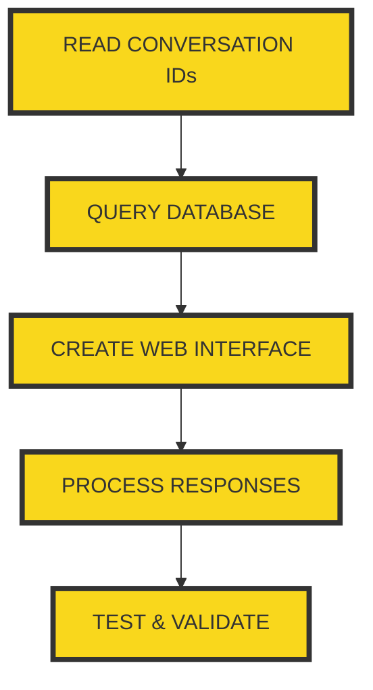

# LLM Search Viewer Progress

## Current Task
Creating a web interface to browse LLM conversation records

## Progress Tracking

## Steps
1. [ ] Read conversation IDs
2. [ ] Query SQLite database
3. [ ] Create Flask web interface
4. [ ] Process and categorize responses
5. [ ] Test functionality

